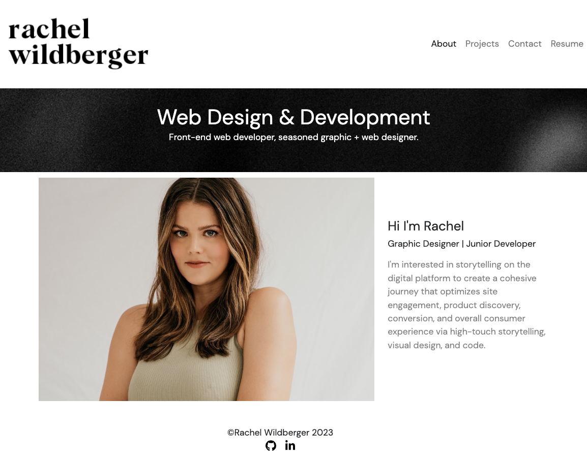
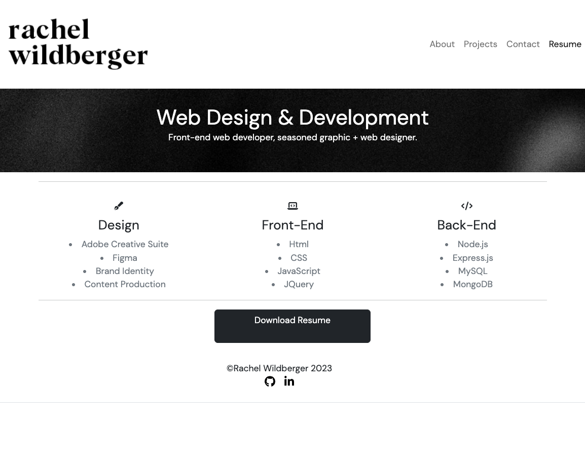

# React-Portfolio

  ## Table of Contents
  - [Description](#description)
  - [Installation](#installation)
  - [Useage](#useage)
  - [Testing](#testing)
  - [Collaborators](#collaborators)
  - [Questions](#questions)

  ## Description 
  Built a Portfolio showcasing my top class projects and repos using React and Bootstrap. This project includes the following: Navigation component, Header & Footer components, project page, and contact page witj a contact form. 

  ## Installation
  To install my React Portfolio, clone the repo and use commands:
  * ``npm install``
  * ``npm start``

  ## Useage 
 View the deployed site [here](https://drive.google.com/file/d/16Wg8OVcxMUf22gNFu9plRhyAmG44_hM-/view?usp=sharing).
  

  ## Testing 
  n/a

  ## Collaborators 
  n/a

  ## Questions?

  GitHub: [@RachelWildberger](https://github.com/RachelWildberger)

  Email: rachelwildberger@icloud.com